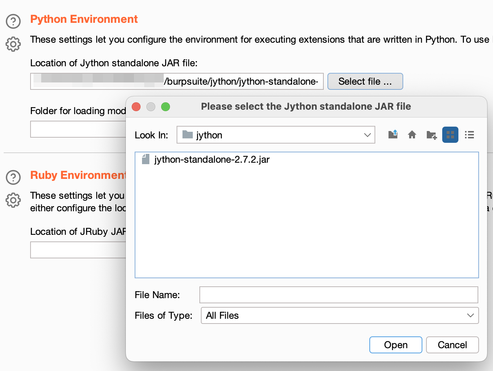
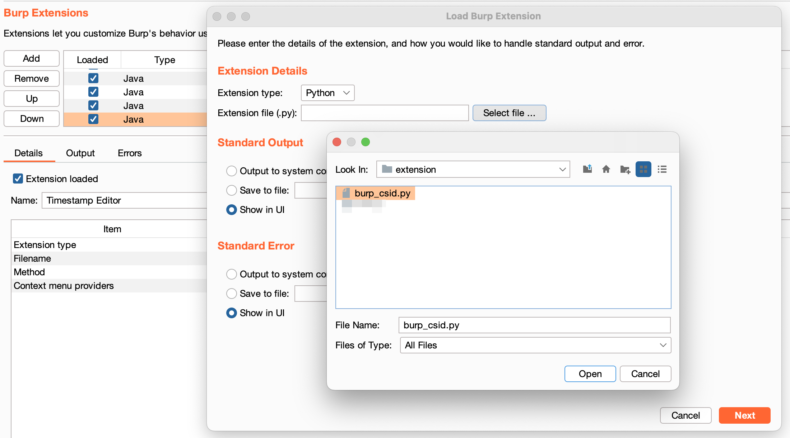
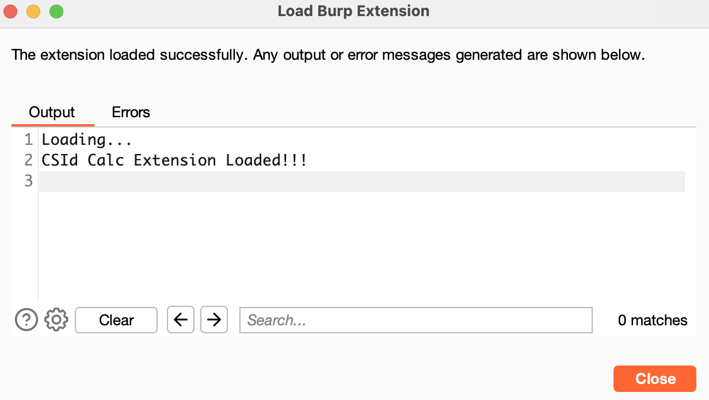

# BurpSuite Extension - Session ID Entropy Calculator(CSId Calc)
BurpSuite Extension for computing Entropy for Session ID.
I made it based on what I made with Python.
- https://github.com/happylie/CSId-Calc
- https://happylie.tistory.com/145 (Only Korean)

## Description 
In this extension, when a session ID value is entered, the result value is derived by checking the corresponding session ID based on the contents below.
- Characters Check
  - Lower Case : 26
  - Upper Case : 26
  - Lower & Upper Case : 52
  - Arabic numerals : 10
  - Lower Case & Arabic numerals : 36
  - Upper Case & Arabic numerals : 36
  - Lower & Upper Case & Arabic numerals : 62

- Session String Length

## Setup
1. Download [Jython](https://www.jython.org/download) in Burp Suite

2. Download the extension
3. In the 'Extensions' tab under 'Extender', select 'Add'
4. Change the extension type to 'Python'
5. Provide the path of the file ‘burp_csid.py’ and click on 'Next'

6. Load Burp Extension Output : 'CSId Calc Extension Loaded!!'

## Usage
Copy the session ID value, put it in Input, and click the calc button.
 
When you click the Clear button, all result values checked so far are deleted.

## Requirements
- [Jython 2.7.2](https://www.jython.org/download)
- Burp Suite 

## Todo
1. We are preparing to calculate the session ID value copied from the Extensions menu by right-clicking anywhere in BurpSuite.
2. It is a function available only in BurpSuite Pro, but it is being prepared to use the Issue activity.